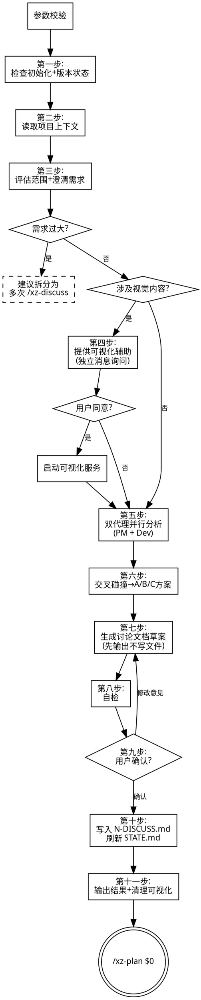

# XZ Discuss - 双代理产品讨论

你收到的参数: `$ARGUMENTS`

其中 `$0` 是版本号 N，`$0` 之后的内容是讨论主题/想法/需求描述。

### 参数校验

如果 `$ARGUMENTS` 为空或 `$0` 不是正整数，**立即停止**，提示：

> 缺少版本号。用法: `/xz-discuss N 讨论内容`
> 示例: `/xz-discuss 1 做一个客户管理工具`

**定位：** 启动两个子代理（PM 代理 + Dev 代理）分别从产品和技术视角分析需求，交叉碰撞后收敛为 A/B/C 方案，给出推荐。输出的 `N-DISCUSS.md` 会被后续 `/xz-plan` 自动引用。

**示例调用：**
- `/xz-discuss 1 做一个给自由职业者用的客户管理工具`
- `/xz-discuss 2 想给 App 加个 AI 搜索功能，先帮我想清楚`
- `/xz-discuss 3 用户反馈登录太慢，讨论下优化方案`

---

## 路径说明

**辅助脚本：**
插件 `bin/` 目录下的 `xz-tools.py`（插件启用时自动加入 PATH）
脚本在**当前工作目录**下操作 `.xz_planning/`。

**确定本 skill 所在目录：**

```bash
SKILL_DIR=$(xz-tools.py skill-dir xz-discuss | python3 -c "import sys,json;print(json.load(sys.stdin)['skill_dir'])")
```

将输出结果记为 `SKILL_DIR`，后续所有相对路径基于此目录。

**skill 目录结构：**

| 文件 | 路径 | 说明 |
|------|------|------|
| PM 代理角色 | `$SKILL_DIR/agents/pm-agent.md` | 启动子代理前必须先读取 |
| Dev 代理角色 | `$SKILL_DIR/agents/dev-agent.md` | 启动子代理前必须先读取 |
| 可视化指南 | `$SKILL_DIR/visual-companion.md` | 开启可视化前读取 |
| 可视化启动脚本 | `$SKILL_DIR/scripts/start-server.sh` | 启动浏览器可视化服务 |
| 可视化停止脚本 | `$SKILL_DIR/scripts/stop-server.sh` | 停止可视化服务 |

**可视化**是**可选**的。在第四步中，如果讨论涉及架构图、流程图、模块关系等视觉内容，可以提供可视化辅助。用户同意后才启用。

---

## 流程图



---

## 执行流程

### 第一步：检查初始化 + 版本状态

检查 `.xz_planning/` 是否存在，不存在则停止提示 `/xz-init`。

```bash
xz-tools.py parse $0
```

- **N-DISCUSS.md 已存在** → 提示已有讨论文档，询问覆盖还是追加
- **N-PLAN.md 已存在** → 提示已有计划，讨论文档仍可创建作为补充
- **都不存在** → 正常流程

### 第二步：读取项目上下文

读取 `.xz_planning/PROJECT.md`（如果存在）+ 用 Glob/Read 扫描需求涉及的现有代码。

**扫描排除规则：**
- 排除 `.xz_planning/` 目录 — 规划系统自身数据，不是项目代码
- 排除 `.gitignore` 中声明的文件和目录（如 `node_modules/`、`dist/`、`__pycache__/`、`.env` 等）
- 只关注项目实际源码和配置文件

### 第三步：评估范围 + 澄清需求

**范围评估（优先）：**
- 如果需求涉及**多个独立子系统**（如"做一个平台，有聊天、文件存储、计费、分析"），**立即指出**，建议拆分为多次 `/xz-discuss`，每个子需求独立讨论
- 不要在拆分前深入细节

**澄清提问（使用 AskUserQuestion 工具逐条进行）：**
- **一次只问一个问题**，每次调用 AskUserQuestion 只包含 1 个 question，等用户回复后再问下一个
- **优先选择题**，将选项映射为 AskUserQuestion 的 options（2-4 个选项），用户可通过内置 Other 自由输入
- 聚焦：目的、约束条件、成功标准、用户预期
- 轻量需求（意图已经很清晰）可以跳过，直接进入第四步

**澄清问题示例（AskUserQuestion 格式）：**

示例 1:
- question: "这个工具主要给谁用？"
- header: "目标用户"
- options: label: "内部团队" / label: "外部客户" / label: "两者都有"
- multiSelect: false

示例 2:
- question: "数据量大概什么级别？"
- header: "数据规模"
- options: label: "百级" / label: "万级" / label: "百万级以上"
- multiSelect: false

示例 3（开放题，仍用 AskUserQuestion）:
- question: "有没有必须集成的现有系统？"
- header: "系统集成"
- options: label: "没有", description: "独立运行" / label: "有", description: "请在 Other 中说明具体系统"
- multiSelect: false

### 第四步：提供可视化辅助（可选）

如果讨论涉及架构、流程、UI 等视觉内容，**单独发一条消息**询问：

> "接下来的讨论可能涉及架构图/流程图，用浏览器展示会更直观。需要开启可视化辅助吗？（需要打开本地 URL）"

**这条消息必须独立发送，不要和其他内容混在一起。** 等用户回复后再继续。

- **用户拒绝** → 纯文本继续，跳到第五步
- **用户同意** → 按下面的流程启动可视化服务：

#### 4.1 读取可视化指南

读取 `$SKILL_DIR/visual-companion.md`，了解完整的 CSS 类和交互规范。

#### 4.2 启动可视化服务

用 Bash 工具执行（`$SKILL_DIR` 替换为第一步确定的实际路径）：

```bash
bash $SKILL_DIR/scripts/start-server.sh --project-dir "$(pwd)"
```

其中 `$SKILL_DIR` 已在路径说明部分通过 `xz-tools.py skill-dir xz-discuss` 获取。

服务启动后输出 JSON：
```json
{
  "type": "server-started",
  "port": 52341,
  "url": "http://localhost:52341",
  "screen_dir": "<项目根目录>/.xz_planning/visual/<session-id>"
}
```

`screen_dir` 是服务创建的**会话目录**，位于项目的 `.xz_planning/visual/` 下，格式为 `<pid>-<timestamp>`。所有可视化 HTML 文件都写入这个目录，服务端自动监视并提供最新文件给浏览器。

**必须保存两个值，后续步骤要用：**
- `VISUAL_URL` — 从返回 JSON 的 `url` 字段获取，如 `http://localhost:52341`
- `SCREEN_DIR` — 从返回 JSON 的 `screen_dir` 字段获取，如 `/Users/you/project/.xz_planning/visual/12345-1706000000`

这两个值在整个讨论过程中保持不变，直到第十一步清理。

#### 4.3 告知用户打开浏览器

```
可视化服务已启动，请在浏览器中打开: http://localhost:52341
```

#### 4.4 后续步骤中使用可视化

开启后，在**第六步（交叉碰撞）和第七步（草案展示）** 中，可以用 Write 工具向 `$SCREEN_DIR` 写入 HTML 文件来展示可视化内容：

```bash
# 写入方案对比页面（用 Write 工具，不要用 cat/heredoc）
# 文件路径: $SCREEN_DIR/comparison.html
# 服务端自动提供最新文件给浏览器
```

**HTML 内容示例 — 方案对比卡片：**
```html
<h2>方案对比</h2>
<p class="subtitle">点击选择你倾向的方案</p>

<div class="options">
  <div class="option" data-choice="a" onclick="toggleSelect(this)">
    <div class="letter">A</div>
    <div class="content">
      <h3>方案 A: MVP 精简版</h3>
      <p>核心功能 + 最小依赖，约 5 条 todo</p>
    </div>
  </div>
  <div class="option" data-choice="b" onclick="toggleSelect(this)">
    <div class="letter">B</div>
    <div class="content">
      <h3>方案 B: 完整版</h3>
      <p>全功能覆盖，约 12 条 todo</p>
    </div>
  </div>
</div>
```

**每次展示后：**
1. 在终端告知用户页面内容概要 + 提醒 URL
2. 等待用户在终端回复
3. 检查 `$SCREEN_DIR/.events` 获取浏览器中的点击选择
4. 不需要浏览器时，推送等待页面：
   ```html
   <!-- 写入 $SCREEN_DIR/waiting.html -->
   <div style="display:flex;align-items:center;justify-content:center;min-height:60vh">
     <p class="subtitle">继续在终端中对话...</p>
   </div>
   ```

**可视化适用场景：**
- 方案对比卡片（A/B/C 方案可视化对比）
- 架构图 / 模块关系图
- 数据流图 / 流程图
- 不用于纯文字问答

### 第五步：启动双代理分析

读取角色定义文件，使用 Agent 工具启动两个子代理，**并行执行**。

#### 子代理 A：PM 代理

1. 读取 `$SKILL_DIR/agents/pm-agent.md` 获取角色定义
2. 将以下内容注入提示词：
   - 角色定义（pm-agent.md 全文）
   - 需求描述: {用户输入 + 澄清结果}
   - 项目上下文: {PROJECT.md 摘要}
3. 用 Agent 工具启动

#### 子代理 B：Dev 代理

1. 读取 `$SKILL_DIR/agents/dev-agent.md` 获取角色定义
2. 将以下内容注入提示词：
   - 角色定义（dev-agent.md 全文）
   - 需求描述: {用户输入 + 澄清结果}
   - 项目上下文: {PROJECT.md 摘要}
   - 现有代码结构: {关键文件列表，排除 .xz_planning/ 和 .gitignore 忽略的文件}
3. 用 Agent 工具启动

### 第六步：交叉碰撞 → 生成方案

收到两个子代理结果后，进行交叉分析：

1. **对齐功能清单** — PM 提的功能 vs Dev 评估的复杂度，合并为统一表格
2. **识别分歧点** — PM 认为必须做但 Dev 认为复杂度高的、Dev 认为简单但 PM 认为价值低的
3. **收敛为 A/B/C 方案** — 基于不同的取舍维度组合出 2-3 套方案

**方案生成规则：**

- 方案之间必须有**实质差异**（不同的功能范围、不同的技术路径、不同的 MVP 边界）
- 每个方案是一个完整可执行的组合，不是单点对比
- **推荐方案放在最前**，附一句话理由

### 第七步：生成讨论文档草案

**先输出到对话中，不写文件！**

**获取当前时间：**

```bash
date "+%Y-%m-%d %H:%M:%S"
```

如果开启了可视化，可以同时在浏览器中展示方案对比的可视化版本。

```markdown
# 版本 N: 简短中文需求名 - 产品讨论

> 创建时间: YYYY-MM-DD HH:mm:ss

## 需求重述

2-3 句话重新定义需求，比用户原话更清晰更精确。

## 分析背景

### 目标用户
- **核心用户** — 谁，什么痛点
- **次级用户** — 谁，什么场景

### 核心场景
1. 场景描述（一句话）
2. ...

## 功能与复杂度评估

| # | 功能 | 产品价值 | 开发复杂度 | PM 备注 | Dev 备注 |
|---|------|---------|-----------|---------|---------|
| 1 | xxx | 高 | 低 | 用户强需求 | 现有框架直接支持 |
| 2 | xxx | 高 | 高 | 核心差异化 | 需引入新依赖，约 3 天 |
| 3 | xxx | 低 | 中 | 锦上添花 | 改动范围大 |

## 方案对比

### 方案 A (推荐): 方案名称

**思路:** 一句话说清核心取舍

**功能范围:**
- 功能 1、2、3
- 不做功能 4、5

**技术路径:** 用什么方案实现，改动哪些模块

**改动范围:**
- 新建: xxx
- 修改: xxx
- 依赖: xxx

**优点:** ...
**缺点:** ...
**开发量:** 约 X 条 todo

---

### 方案 B: 方案名称

（同上结构）

---

### 方案 C: 方案名称

（同上结构，如果只有两种合理方案可以省略 C）

---

### 对比总结

| 维度 | 方案 A | 方案 B | 方案 C |
|------|--------|--------|--------|
| 功能覆盖 | 核心 + 部分扩展 | 仅核心 | 全量 |
| 开发量 | 中 (约 5 条) | 小 (约 3 条) | 大 (约 8 条) |
| 技术风险 | 低 | 低 | 中 |
| 扩展性 | 好 | 一般 | 最好 |

**推荐方案 A:** 一句话理由

## 风险与待确认

### 已知
- ...

### 假设（需验证）
- ...

### 待确认
- ...

## 变更记录
- YYYY-MM-DD HH:mm:ss 初始创建
```

### 第八步：自检

在展示给用户前，快速检查草案：
- 有无 TBD/待定/占位符未填写
- 方案之间是否有实质差异（不是换个说法）
- 推荐理由是否充分
- 功能评估表是否完整（每条都有 PM + Dev 备注）

不合格则自行修正后再展示。

### 第九步：等待确认

使用 AskUserQuestion 工具确认讨论文档：

- question: "以上讨论文档是否确认？"
- header: "文档确认"
- options:
  - label: "确认写入", description: "保存 N-DISCUSS.md 并刷新 STATE.md"
  - label: "确认并选方案", description: "指定推荐方案后写入，后续 /xz-plan N 据此生成 todolist"
  - label: "修改意见", description: "调整后重新输出草案"
- multiSelect: false

其中 N 替换为用户传入的实际版本号。用户选择「确认并选方案」时，追问选择哪个方案（或用户在 Other 中直接指定如"确认，选方案 A"）。用户选择「修改意见」或 Other 时，按其反馈调整后重新输出草案。

**禁止自动写入文件。必须等待明确确认。**

### 第十步：确认后写入文件

1. **确定目录**：
   - 如果 `.xz_planning/phases/N.xxx/` 已存在 → 直接写入该目录
   - 如果不存在 → 从讨论主题中提取简短中文目录名，创建目录

2. **写入文件**：`.xz_planning/phases/N.中文需求名/N-DISCUSS.md`

3. **刷新 STATE.md**：

```bash
xz-tools.py update-state
```

### 第十一步：输出结果

**如果开启了可视化：** 停止可视化服务，释放端口。

```bash
bash $SKILL_DIR/scripts/stop-server.sh $SCREEN_DIR
```

`$SCREEN_DIR` 是第四步启动时保存的目录路径。如果未开启可视化则跳过此步。

输出时将 `$0` 替换为用户传入的实际版本号：

```
讨论文档已写入:
  .xz_planning/phases/$0.xxx/$0-DISCUSS.md
```

然后使用 AskUserQuestion 工具让用户选择下一步操作：

- question: "接下来要做什么？"
- header: "下一步"
- options:
  - label: "/xz-plan $0", description: "基于讨论结果创建执行计划（自动引用 DISCUSS）"
  - label: "/xz-status", description: "查看所有版本状态"
- multiSelect: false

其中 `$0` 替换为用户传入的实际版本号。用户选择后，执行对应的 skill 命令。如果用户选择 Other，按其输入内容响应。

---

## 关键规则

1. **双代理并行** — PM 代理和 Dev 代理用 Agent 工具并行执行，各自独立分析
2. **角色外置** — 从 `$SKILL_DIR/agents/` 读取角色定义，不内联
3. **必须出方案** — 最终输出必须收敛为 A/B/C 方案对比，不能只列分析不给结论
4. **方案要有实质差异** — 不同的功能范围或不同的技术路径，不是换个说法
5. **推荐必须明确** — 标注推荐方案 + 一句话理由
6. **先输出后写文件** — 用户确认后才写入
7. **一次一个问题** — 澄清阶段逐条提问，不要一次抛出多个问题
8. **范围先行** — 发现需求过大立即建议拆分，不要在拆分前深入细节
9. **假设必须标注** — 区分已知/假设/待确认，不把猜测伪装成事实
10. **不生成 todolist** — 讨论只负责收敛方向和方案，具体 todolist 由 `/xz-plan` 生成
11. **与 plan 联动** — N-DISCUSS.md 会被 `/xz-plan` 自动引用，选定的方案直接指导 todolist 生成
